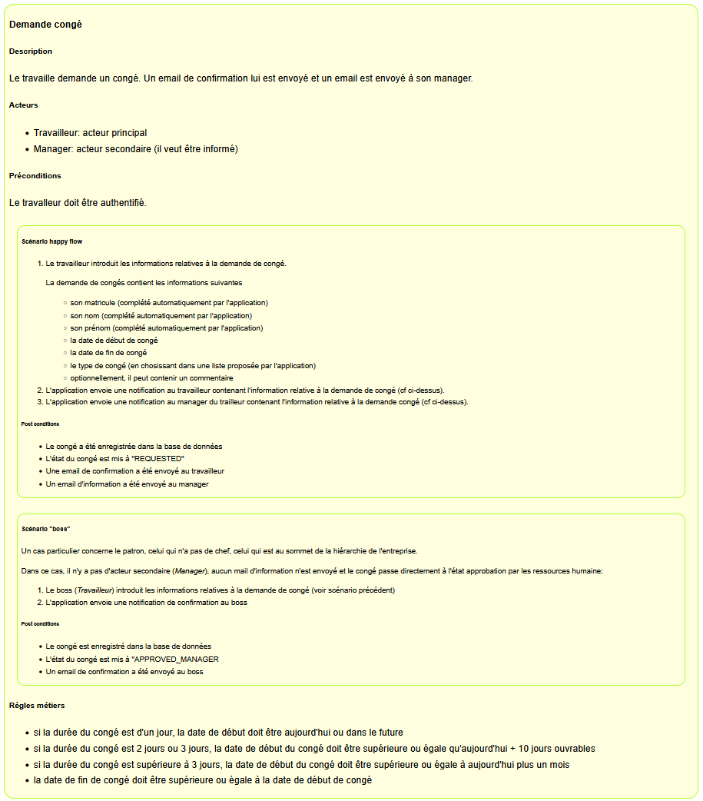
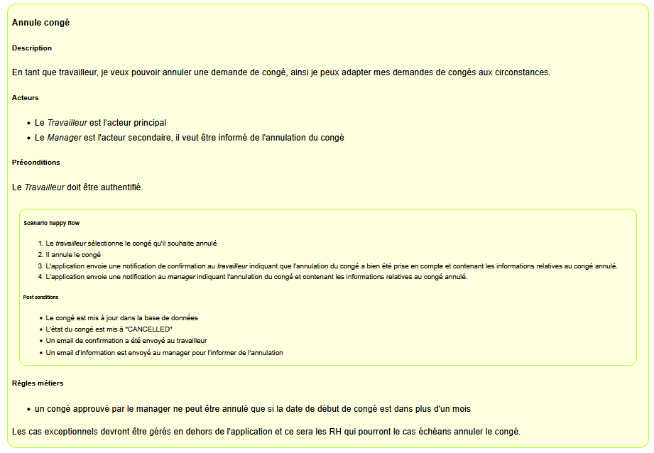
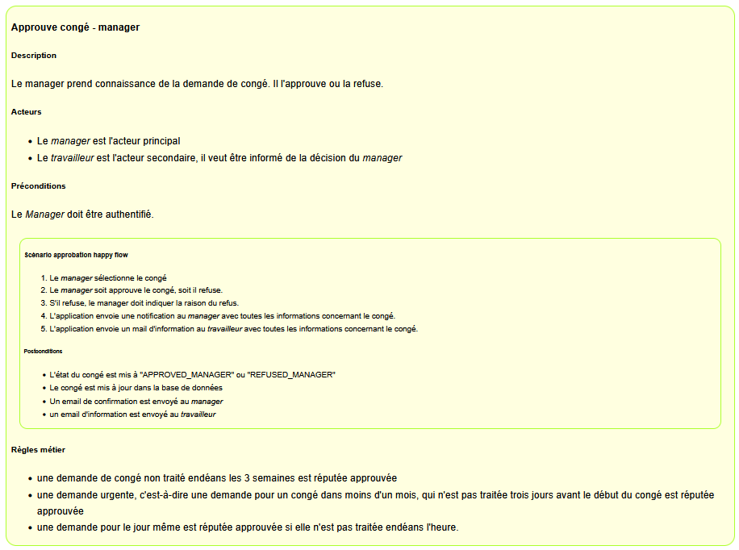

[top](readme.md)
# Gabarit pour les scénarios
Je propose ici un gabarit, un modèle pour documenter les use cases avec des scénarios.
Notons que ce gabarit convient aussi pour les user stories.

Le use case est documenté par :
1. le nom du use case (et sa référence s'il y en a une)
2. une courte description du use case
3. les préconditions
4. la liste des acteurs
5. pour chaque scénario :
   1. les étapes du scénario
   2. les postconditions
6. règles métiers

Les préconditions sont les conditions nécessaires pour que le use case puisse être "joué". Un exemple typique est "l'acteur doit être authentifié". Les caractéristiques clés d'une précondition sont :
- stabilité : si une précondition n'est pas satisfaite, le cas d'utilisation ne peut pas être joué : il ne sera pas possible de le démarrer, l'application l'interdira;
- hors périmètre : le scénario ne décrit pas comment la précondition est devenue vrai, il admet qu'elle l'est
- vérifiabilité : l'application doit être capable de vérifier ces préconditions.

Les étapes du scénario décrivent ce que les acteurs font et ce que l'application fait, séquentiellement. Par exemple :
- l'acteur complète le formulaire en précisant son prénom, son nom de famille, son email et sa question 
- l'application envoie un mail de confirmation.
Notons qu'on ne doit pas décrire tous ce que l'acteur fait dans l'application. Nous devons capturer le flux d'information métier.

Les post-conditions est ce qui a changé suite à l'exécution du scénario. Typiquement, le contenu de la DB a changé et éventuellement d'autres éléments comme des emails envoyés, des états qui ont changé dans les applications-acteurs ou les composants électroniques-acteurs. Par exemple :
- la question est enregistrée dans la DB
- un mail de confirmation a été envoyé à l'acteur

Nous pouvons ajouter les règles métier, soit séparément, soit dans les étapes. Par exemple :
- le prénom doit contenir minimum 2 caractères et maximum 40 caractères
- le nom de famille doit contenir minimum 2 caractères et maximum 60 caractères
- l'email doit être un email
- la question doit contenir minimum 4 caractères et maximum 500 caractères.

## Exemples

### Demande un congé

### Annule un congé

### Approuve un congé
